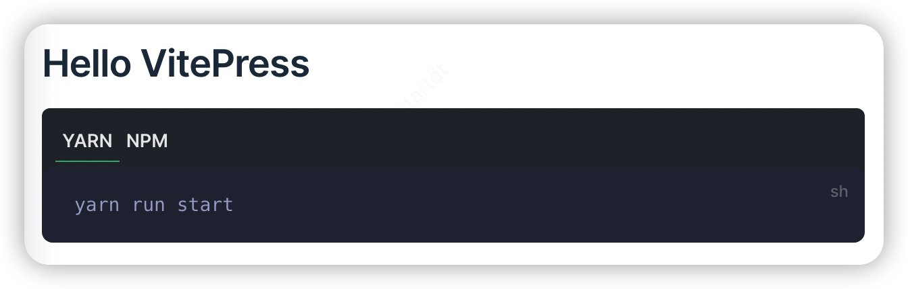

# vitepress-plugin-code-group

该插件是迁移自 `vuepress` 的默认主题，由于目前版本的 `vitepress` 暂不支持该组件(未来应该会支持)，具体可看这个 [issues](https://github.com/vuejs/vitepress/pull/232)


## 如何使用

1. 安装

```bash
npm install vitepress-plugin-code-group
```

2. 使用

```js
// .vitepress/theme/index.js

import DefaultTheme from 'vitepress/theme'
import  {CodeGroup,CodeGroupItem} from 'vitepress-plugin-code-group';
import 'vitepress-plugin-code-group/dist/style.css'
export default {
  ...DefaultTheme,
  enhanceApp({ app }) {
    // add 
    app.component('CodeGroup', CodeGroup);
    app.component('CodeGroupItem', CodeGroupItem)
    // end
  },
}

```

3. 在 markdown 中

```js

<code-group>
<code-block title="YARN" active>

// some code 

</code-block>

<code-block title="NPM">

// some code 

</code-block>
</code-group>

```

4. 展示 

